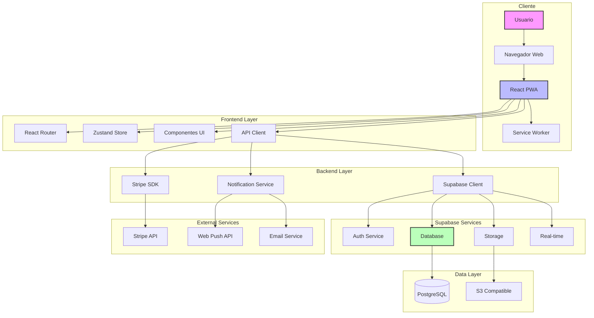
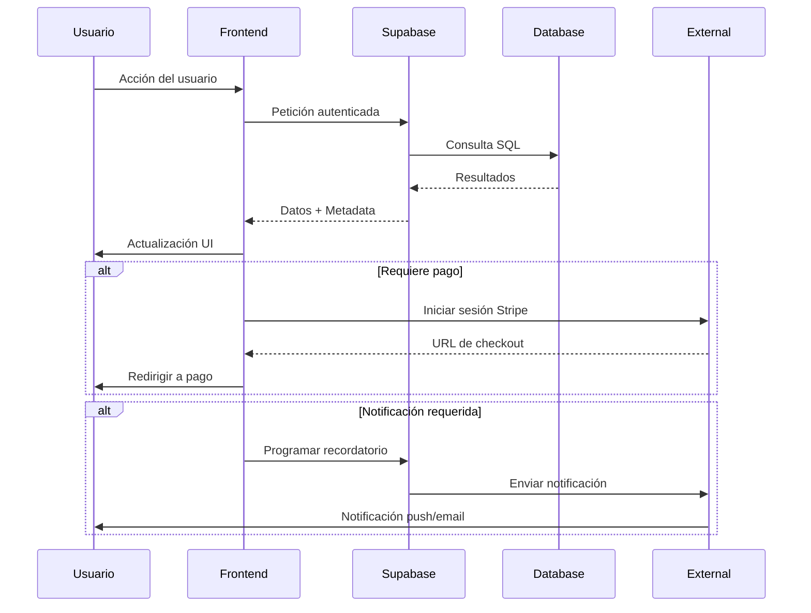
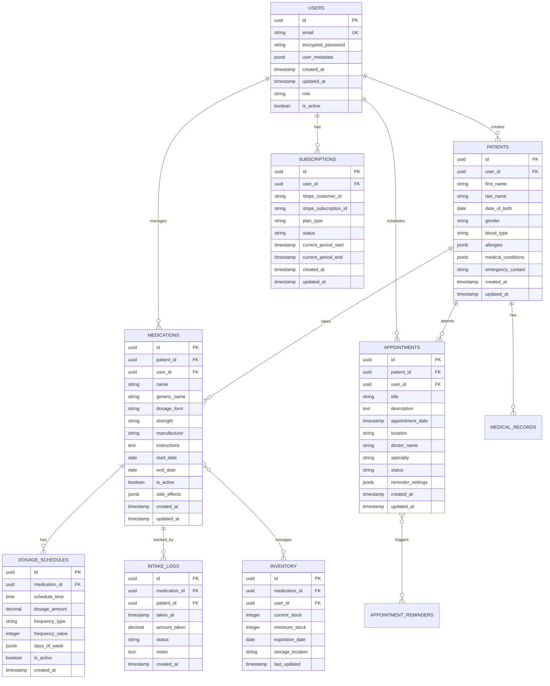

# MediTrack - Documento de Arquitectura Técnica

## 1. ARQUITECTURA GENERAL

### 1.1 Diagrama de Arquitectura Completa



### 1.2 Stack Tecnológico Detallado

**Frontend:**
- React 18.2.0 con TypeScript 5.0
- Vite 4.4 como build tool
- Tailwind CSS 3.3 para estilos
- Zustand 4.4 para gestión de estado
- React Query 4.32 para cache y sincronización de datos
- React Hook Form 7.45 para formularios
- Framer Motion 10.16 para animaciones
- PWA con Workbox 7.0

**Backend & Servicios:**
- Supabase como BaaS principal
- PostgreSQL 15 como base de datos
- Stripe para procesamiento de pagos
- Node.js 18 para funciones edge cuando sea necesario

**DevOps & Deployment:**
- Vercel para hosting frontend
- GitHub Actions para CI/CD
- Sentry para monitoreo de errores
- Analytics con PostHog

### 1.3 Flujo de Datos entre Componentes



## 2. ESTRUCTURA DE BASE DE DATOS

### 2.1 Esquema Completo de Tablas



### 2.2 Políticas de Seguridad RLS (Row Level Security)

```sql
-- Políticas para usuarios (solo usuarios autenticados pueden ver sus propios datos)
CREATE POLICY "Users can only see own data" ON users
    FOR SELECT USING (auth.uid() = id);

-- Políticas para pacientes
CREATE POLICY "Users can manage own patients" ON patients
    FOR ALL USING (auth.uid() = user_id);

-- Políticas para medicamentos
CREATE POLICY "Users can manage own medications" ON medications
    FOR ALL USING (auth.uid() = user_id);

CREATE POLICY "Patients can view own medications" ON medications
    FOR SELECT USING (patient_id IN (
    SELECT id FROM patients WHERE user_id = auth.uid()
));

-- Políticas para citas
CREATE POLICY "Users can manage own appointments" ON appointments
    FOR ALL USING (auth.uid() = user_id);

-- Políticas para logs de toma
CREATE POLICY "Users can view intake logs" ON intake_logs
    FOR SELECT USING (
    medication_id IN (
        SELECT id FROM medications WHERE user_id = auth.uid()
    )
);

CREATE POLICY "System can create intake logs" ON intake_logs
    FOR INSERT WITH CHECK (true);
```

### 2.3 Índices y Optimizaciones

```sql
-- Índices para búsquedas rápidas
CREATE INDEX idx_patients_user_id ON patients(user_id);
CREATE INDEX idx_medications_patient_id ON medications(patient_id);
CREATE INDEX idx_medications_user_id ON medications(user_id);
CREATE INDEX idx_medications_active ON medications(is_active) WHERE is_active = true;
CREATE INDEX idx_dosage_schedules_medication_id ON dosage_schedules(medication_id);
CREATE INDEX idx_intake_logs_medication_date ON intake_logs(medication_id, taken_at DESC);
CREATE INDEX idx_appointments_user_date ON appointments(user_id, appointment_date);
CREATE INDEX idx_appointments_patient_date ON appointments(patient_id, appointment_date);

-- Índices para búsquedas de texto
CREATE INDEX idx_medications_name_trgm ON medications USING gin (name gin_trgm_ops);
CREATE INDEX idx_patients_name_trgm ON patients USING gin (
    (first_name || ' ' || last_name) gin_trgm_ops
);

-- Índices para notificaciones tiempo real
CREATE INDEX idx_dosage_schedules_active_time ON dosage_schedules(is_active, schedule_time);
```

## 3. COMPONENTES FRONTEND

### 3.1 Estructura de Carpetas del Proyecto

```
src/
├── components/
│   ├── auth/
│   │   ├── LoginForm.tsx
│   │   ├── RegisterForm.tsx
│   │   └── ProtectedRoute.tsx
│   ├── dashboard/
│   │   ├── DashboardLayout.tsx
│   │   ├── StatsCards.tsx
│   │   └── QuickActions.tsx
│   ├── medications/
│   │   ├── MedicationList.tsx
│   │   ├── MedicationForm.tsx
│   │   ├── DosageScheduler.tsx
│   │   └── IntakeTracker.tsx
│   ├── patients/
│   │   ├── PatientList.tsx
│   │   ├── PatientForm.tsx
│   │   └── PatientProfile.tsx
│   ├── appointments/
│   │   ├── AppointmentCalendar.tsx
│   │   ├── AppointmentForm.tsx
│   │   └── ReminderSettings.tsx
│   ├── common/
│   │   ├── Button.tsx
│   │   ├── Input.tsx
│   │   ├── Modal.tsx
│   │   └── LoadingSpinner.tsx
│   └── ui/
│       ├── charts/
│       ├── forms/
│       └── layouts/
├── hooks/
│   ├── useAuth.ts
│   ├── useMedications.ts
│   ├── usePatients.ts
│   ├── useNotifications.ts
│   └── useSubscription.ts
├── stores/
│   ├── authStore.ts
│   ├── medicationStore.ts
│   ├── patientStore.ts
│   └── notificationStore.ts
├── services/
│   ├── supabase.ts
│   ├── stripe.ts
│   ├── notifications.ts
│   └── api.ts
├── utils/
│   ├── constants.ts
│   ├── helpers.ts
│   ├── validators.ts
│   └── formatters.ts
├── types/
│   ├── auth.types.ts
│   ├── medication.types.ts
│   ├── patient.types.ts
│   └── api.types.ts
├── pages/
│   ├── Login.tsx
│   ├── Dashboard.tsx
│   ├── Medications.tsx
│   ├── Patients.tsx
│   ├── Appointments.tsx
│   └── Settings.tsx
└── App.tsx
```

### 3.2 Componentes Principales y Responsabilidades

**Auth Components:**
- `LoginForm`: Maneja autenticación con email/contraseña y OAuth
- `RegisterForm`: Registro de nuevos usuarios con validación
- `ProtectedRoute`: Wrapper para rutas que requieren autenticación

**Dashboard Components:**
- `DashboardLayout`: Layout principal con navegación
- `StatsCards`: Muestra estadísticas clave (medicamentos activos, próximas citas)
- `QuickActions`: Acciones rápidas (agregar medicamento, programar cita)

**Medication Components:**
- `MedicationList`: Lista paginada de medicamentos con filtros
- `MedicationForm`: Formulario CRUD para medicamentos
- `DosageScheduler`: Programador visual de horarios
- `IntakeTracker`: Registro de tomas con confirmación

### 3.3 Gestión de Estado con Zustand

```typescript
// authStore.ts
interface AuthStore {
  user: User | null;
  isAuthenticated: boolean;
  login: (email: string, password: string) => Promise<void>;
  logout: () => Promise<void>;
  checkSession: () => Promise<void>;
}

// medicationStore.ts
interface MedicationStore {
  medications: Medication[];
  selectedMedication: Medication | null;
  loading: boolean;
  fetchMedications: () => Promise<void>;
  addMedication: (medication: MedicationInput) => Promise<void>;
  updateMedication: (id: string, updates: Partial<Medication>) => Promise<void>;
  deleteMedication: (id: string) => Promise<void>;
}

// notificationStore.ts
interface NotificationStore {
  notifications: Notification[];
  permission: NotificationPermission;
  requestPermission: () => Promise<void>;
  scheduleReminder: (reminder: ReminderInput) => Promise<void>;
  cancelReminder: (id: string) => Promise<void>;
}
```

### 3.4 Sistema de Routing

```typescript
// App.tsx - Configuración principal de rutas
const router = createBrowserRouter([
  {
    path: "/login",
    element: <LoginPage />,
  },
  {
    path: "/register",
    element: <RegisterPage />,
  },
  {
    path: "/",
    element: <ProtectedRoute><DashboardLayout /></ProtectedRoute>,
    children: [
      {
        index: true,
        element: <Dashboard />,
      },
      {
        path: "medications",
        element: <MedicationsPage />,
      },
      {
        path: "patients",
        element: <PatientsPage />,
      },
      {
        path: "appointments",
        element: <AppointmentsPage />,
      },
      {
        path: "settings",
        element: <SettingsPage />,
      },
    ],
  },
]);
```

## 4. INTEGRACIONES EXTERNAS

### 4.1 Configuración de Supabase

```typescript
// supabase.ts
import { createClient } from '@supabase/supabase-js'

const supabaseUrl = import.meta.env.VITE_SUPABASE_URL
const supabaseAnonKey = import.meta.env.VITE_SUPABASE_ANON_KEY

export const supabase = createClient(supabaseUrl, supabaseAnonKey, {
  auth: {
    persistSession: true,
    autoRefreshToken: true,
    detectSessionInUrl: true
  },
  realtime: {
    params: {
      eventsPerSecond: 10
    }
  }
})

// Configuración de buckets de almacenamiento
export const STORAGE_BUCKETS = {
  PATIENT_PHOTOS: 'patient-photos',
  MEDICATION_IMAGES: 'medication-images',
  DOCUMENTS: 'medical-documents'
} as const
```

### 4.2 Integración con Stripe

```typescript
// stripe.ts
import { loadStripe } from '@stripe/stripe-js'

const stripePromise = loadStripe(import.meta.env.VITE_STRIPE_PUBLISHABLE_KEY)

export const createCheckoutSession = async (priceId: string, userId: string) => {
  const { data, error } = await supabase.functions.invoke('create-checkout-session', {
    body: { priceId, userId }
  })
  
  if (error) throw error
  return data.sessionId
}

export const manageBilling = async (customerId: string) => {
  const { data, error } = await supabase.functions.invoke('create-portal-session', {
    body: { customerId }
  })
  
  if (error) throw error
  return data.url
}
```

### 4.3 Sistema de Notificaciones

```typescript
// notifications.ts
export class NotificationService {
  private swRegistration: ServiceWorkerRegistration | null = null

  async initialize() {
    if ('serviceWorker' in navigator) {
      this.swRegistration = await navigator.serviceWorker.register('/sw.js')
    }
    
    if ('Notification' in window) {
      await this.requestPermission()
    }
  }

  async requestPermission(): Promise<NotificationPermission> {
    const permission = await Notification.requestPermission()
    
    if (permission === 'granted' && this.swRegistration) {
      await this.subscribeToPushNotifications()
    }
    
    return permission
  }

  async scheduleReminder(medication: Medication, schedule: DosageSchedule) {
    const reminderTime = this.calculateReminderTime(schedule.schedule_time)
    
    await supabase.from('reminders').insert({
      medication_id: medication.id,
      reminder_time: reminderTime,
      type: 'medication',
      status: 'scheduled'
    })
  }

  async sendPushNotification(title: string, body: string, data?: any) {
    if (this.swRegistration && Notification.permission === 'granted') {
      await this.swRegistration.showNotification(title, {
        body,
        icon: '/icon-192x192.png',
        badge: '/badge-72x72.png',
        vibrate: [200, 100, 200],
        data
      })
    }
  }
}
```

## 5. SEGURIDAD Y PRIVACIDAD

### 5.1 Autenticación y Autorización

```typescript
// auth.service.ts
export class AuthService {
  async login(email: string, password: string): Promise<User> {
    const { data, error } = await supabase.auth.signInWithPassword({
      email,
      password
    })
    
    if (error) throw error
    
    // Registrar actividad de login
    await this.logAuthActivity(data.user.id, 'login')
    
    return data.user
  }

  async refreshSession(): Promise<void> {
    const { data, error } = await supabase.auth.refreshSession()
    
    if (error) throw error
    
    // Actualizar token en el store
    useAuthStore.getState().setSession(data.session)
  }

  private async logAuthActivity(userId: string, action: string) {
    await supabase.from('auth_logs').insert({
      user_id: userId,
      action,
      ip_address: await this.getClientIP(),
      user_agent: navigator.userAgent,
      timestamp: new Date().toISOString()
    })
  }
}
```

### 5.2 Encriptación de Datos Sensibles

```typescript
// crypto.service.ts
import { createCipheriv, createDecipheriv, randomBytes, scryptSync } from 'crypto'

export class CryptoService {
  private algorithm = 'aes-256-gcm'
  
  encrypt(text: string, password: string): string {
    const salt = randomBytes(32)
    const key = scryptSync(password, salt, 32)
    const iv = randomBytes(16)
    const cipher = createCipheriv(this.algorithm, key, iv)
    
    let encrypted = cipher.update(text, 'utf8', 'hex')
    encrypted += cipher.final('hex')
    
    const authTag = cipher.getAuthTag()
    
    return salt.toString('hex') + ':' + iv.toString('hex') + ':' + authTag.toString('hex') + ':' + encrypted
  }

  decrypt(encryptedData: string, password: string): string {
    const parts = encryptedData.split(':')
    const salt = Buffer.from(parts[0], 'hex')
    const iv = Buffer.from(parts[1], 'hex')
    const authTag = Buffer.from(parts[2], 'hex')
    const encrypted = parts[3]
    
    const key = scryptSync(password, salt, 32)
    const decipher = createDecipheriv(this.algorithm, key, iv)
    decipher.setAuthTag(authTag)
    
    let decrypted = decipher.update(encrypted, 'hex', 'utf8')
    decrypted += decipher.final('utf8')
    
    return decrypted
  }
}
```

### 5.3 Cumplimiento GDPR

```typescript
// gdpr.service.ts
export class GDPRService {
  async exportUserData(userId: string): Promise<GDPRDataExport> {
    const userData = await this.collectUserData(userId)
    const formattedData = this.formatForExport(userData)
    
    // Generar archivo JSON
    const exportFile = new Blob([JSON.stringify(formattedData, null, 2)], {
      type: 'application/json'
    })
    
    // Registrar exportación
    await this.logDataExport(userId)
    
    return {
      data: formattedData,
      file: exportFile,
      timestamp: new Date().toISOString()
    }
  }

  async deleteUserData(userId: string): Promise<void> {
    // Soft delete primero
    await supabase.from('users').update({ 
      deleted_at: new Date().toISOString(),
      is_active: false 
    }).eq('id', userId)
    
    // Programar hard delete después de 30 días
    await supabase.from('gdpr_deletion_queue').insert({
      user_id: userId,
      scheduled_deletion: new Date(Date.now() + 30 * 24 * 60 * 60 * 1000)
    })
    
    // Revocar todos los tokens y sesiones
    await supabase.auth.admin.deleteUser(userId)
  }

  private async collectUserData(userId: string): Promise<UserDataCollection> {
    const [
      user,
      patients,
      medications,
      appointments,
      intakeLogs
    ] = await Promise.all([
      supabase.from('users').select('*').eq('id', userId).single(),
      supabase.from('patients').select('*').eq('user_id', userId),
      supabase.from('medications').select('*').eq('user_id', userId),
      supabase.from('appointments').select('*').eq('user_id', userId),
      supabase.from('intake_logs').select('*').eq('user_id', userId)
    ])
    
    return {
      userProfile: user.data,
      patients: patients.data,
      medications: medications.data,
      appointments: appointments.data,
      intakeLogs: intakeLogs.data,
      exportTimestamp: new Date().toISOString()
    }
  }
}
```

### 5.4 Auditoría de Accesos

```sql
-- Tabla de auditoría
CREATE TABLE audit_logs (
    id UUID PRIMARY KEY DEFAULT gen_random_uuid(),
    user_id UUID REFERENCES users(id),
    table_name VARCHAR(100),
    record_id UUID,
    action VARCHAR(50),
    old_values JSONB,
    new_values JSONB,
    ip_address INET,
    user_agent TEXT,
    created_at TIMESTAMP WITH TIME ZONE DEFAULT NOW()
);

-- Trigger para auditoría automática
CREATE OR REPLACE FUNCTION audit_trigger_function()
RETURNS TRIGGER AS $$
BEGIN
    IF TG_OP = 'DELETE' THEN
        INSERT INTO audit_logs (table_name, record_id, action, old_values, user_id)
        VALUES (TG_TABLE_NAME, OLD.id, 'DELETE', row_to_json(OLD), auth.uid());
        RETURN OLD;
    ELSIF TG_OP = 'UPDATE' THEN
        INSERT INTO audit_logs (table_name, record_id, action, old_values, new_values, user_id)
        VALUES (TG_TABLE_NAME, NEW.id, 'UPDATE', row_to_json(OLD), row_to_json(NEW), auth.uid());
        RETURN NEW;
    ELSIF TG_OP = 'INSERT' THEN
        INSERT INTO audit_logs (table_name, record_id, action, new_values, user_id)
        VALUES (TG_TABLE_NAME, NEW.id, 'INSERT', row_to_json(NEW), auth.uid());
        RETURN NEW;
    END IF;
    RETURN NULL;
END;
$$ LANGUAGE plpgsql;

-- Aplicar triggers a tablas sensibles
CREATE TRIGGER audit_patients
    AFTER INSERT OR UPDATE OR DELETE ON patients
    FOR EACH ROW EXECUTE FUNCTION audit_trigger_function();

CREATE TRIGGER audit_medications
    AFTER INSERT OR UPDATE OR DELETE ON medications
    FOR EACH ROW EXECUTE FUNCTION audit_trigger_function();
```

## 6. RENDIMIENTO Y ESCALABILIDAD

### 6.1 Optimización de Consultas

```typescript
// query-optimizer.ts
export class QueryOptimizer {
  // Implementar patrón de caché con React Query
  private queryClient = new QueryClient({
    defaultOptions: {
      queries: {
        staleTime: 5 * 60 * 1000, // 5 minutos
        cacheTime: 10 * 60 * 1000, // 10 minutos
        retry: 3,
        retryDelay: attemptIndex => Math.min(1000 * 2 ** attemptIndex, 30000)
      }
    }
  })

  // Paginación eficiente con cursores
  async getMedicationsPaginated(cursor?: string, limit: number = 20) {
    let query = supabase
      .from('medications')
      .select('*')
      .order('created_at', { ascending: false })
      .limit(limit)

    if (cursor) {
      query = query.lt('created_at', cursor)
    }

    const { data, error } = await query
    
    return {
      data,
      nextCursor: data?.[data.length - 1]?.created_at,
      hasMore: data?.length === limit
    }
  }

  // Precarga de datos críticos
  async preloadCriticalData(userId: string) {
    await Promise.all([
      this.queryClient.prefetchQuery(['user', userId], () => this.fetchUser(userId)),
      this.queryClient.prefetchQuery(['medications', userId], () => this.fetchMedications(userId)),
      this.queryClient.prefetchQuery(['patients', userId], () => this.fetchPatients(userId)),
      this.queryClient.prefetchQuery(['appointments', userId], () => this.fetchAppointments(userId))
    ])
  }

  // Optimización de búsquedas con debouncing
  searchMedications(query: string) {
    return debounce(async (searchQuery: string) => {
      const { data, error } = await supabase
        .from('medications')
        .select('*')
        .textSearch('name', searchQuery)
        .limit(10)

      return { data, error }
    }, 300)
  }
}
```

### 6.2 Caché y Estrategias de Carga

```typescript
// cache-strategy.ts
export class CacheStrategy {
  private memoryCache = new Map<string, CacheEntry>()
  private persistence = localStorage

  // Estrategia de caché por tipo de dato
  async getWithStrategy<T>(
    key: string,
    fetcher: () => Promise<T>,
    strategy: CacheStrategyType = 'network-first'
  ): Promise<T> {
    
    switch (strategy) {
      case 'cache-first':
        return await this.cacheFirst(key, fetcher)
      case 'network-first':
        return await this.networkFirst(key, fetcher)
      case 'stale-while-revalidate':
        return await this.staleWhileRevalidate(key, fetcher)
      default:
        return await fetcher()
    }
  }

  private async cacheFirst<T>(key: string, fetcher: () => Promise<T>): Promise<T> {
    const cached = this.getFromCache<T>(key)
    if (cached && !this.isExpired(cached)) {
      return cached.data
    }

    const data = await fetcher()
    this.setInCache(key, data, 5 * 60 * 1000) // 5 minutos
    return data
  }

  private async networkFirst<T>(key: string, fetcher: () => Promise<T>): Promise<T> {
    try {
      const data = await fetcher()
      this.setInCache(key, data, 5 * 60 * 1000)
      return data
    } catch (error) {
      const cached = this.getFromCache<T>(key)
      if (cached) {
        return cached.data
      }
      throw error
    }
  }

  private async staleWhileRevalidate<T>(key: string, fetcher: () => Promise<T>): Promise<T> {
    const cached = this.getFromCache<T>(key)
    
    if (cached) {
      // Devolver datos stale mientras se revalida
      this.revalidateInBackground(key, fetcher)
      return cached.data
    }

    const data = await fetcher()
    this.setInCache(key, data, 5 * 60 * 1000)
    return data
  }

  private async revalidateInBackground<T>(key: string, fetcher: () => Promise<T>) {
    try {
      const data = await fetcher()
      this.setInCache(key, data, 5 * 60 * 1000)
    } catch (error) {
      console.warn('Background revalidation failed:', error)
    }
  }
}
```

### 6.3 Manejo de Errores

```typescript
// error-handler.ts
export class ErrorHandler {
  private sentry: typeof Sentry

  constructor() {
    Sentry.init({
      dsn: import.meta.env.VITE_SENTRY_DSN,
      environment: import.meta.env.MODE,
      tracesSampleRate: 1.0,
      beforeSend: (event, hint) => {
        // Filtrar errores sensibles
        if (this.containsSensitiveData(event)) {
          return null
        }
        return event
      }
    })
  }

  handleError(error: Error, context?: ErrorContext) {
    // Clasificar el error
    const errorType = this.classifyError(error)
    
    switch (errorType) {
      case 'network':
        this.handleNetworkError(error, context)
        break
      case 'validation':
        this.handleValidationError(error, context)
        break
      case 'authentication':
        this.handleAuthError(error, context)
        break
      case 'database':
        this.handleDatabaseError(error, context)
        break
      default:
        this.handleUnexpectedError(error, context)
    }

    // Siempre reportar a Sentry
    Sentry.captureException(error, {
      contexts: {
        custom: context
      }
    })
  }

  private handleNetworkError(error: Error, context?: ErrorContext) {
    // Reintentar con backoff exponencial
    if (context?.retryCount && context.retryCount < 3) {
      setTimeout(() => {
        context.retryFunction?.()
      }, 1000 * Math.pow(2, context.retryCount))
    } else {
      // Mostrar mensaje al usuario
      this.showUserMessage('network_error')
    }
  }

  private handleValidationError(error: Error, context?: ErrorContext) {
    // Mostrar errores de validación específicos
    if (context?.formField) {
      this.showFieldError(context.formField, error.message)
    } else {
      this.showUserMessage('validation_error', error.message)
    }
  }

  private handleAuthError(error: Error, context?: ErrorContext) {
    // Redirigir a login si es necesario
    if (error.message.includes('JWT expired')) {
      useAuthStore.getState().logout()
      window.location.href = '/login?expired=true'
    }
  }

  private handleDatabaseError(error: Error, context?: ErrorContext) {
    // Manejar errores de base de datos específicos
    if (error.message.includes('unique constraint')) {
      this.showUserMessage('duplicate_entry')
    } else {
      this.showUserMessage('database_error')
    }
  }

  private classifyError(error: Error): ErrorType {
    if (error.message.includes('Network') || error.message.includes('fetch')) {
      return 'network'
    }
    if (error.name === 'ValidationError') {
      return 'validation'
    }
    if (error.message.includes('JWT') || error.message.includes('auth')) {
      return 'authentication'
    }
    if (error.message.includes('database') || error.message.includes('SQL')) {
      return 'database'
    }
    return 'unknown'
  }
}
```

### 6.4 Monitoreo y Logging

```typescript
// monitoring.service.ts
export class MonitoringService {
  private metrics: Map<string, Metric> = new Map()
  private performanceObserver: PerformanceObserver

  constructor() {
    this.initializePerformanceMonitoring()
    this.initializeUserMetrics()
  }

  trackEvent(eventName: string, properties?: Record<string, any>) {
    // PostHog para análisis de uso
    posthog.capture(eventName, properties)
    
    // Métricas internas
    this.incrementMetric(`event_${eventName}`)
  }

  trackPerformance(metric: PerformanceMetric) {
    this.metrics.set(metric.name, {
      value: metric.value,
      timestamp: Date.now(),
      metadata: metric.metadata
    })

    // Reportar a Sentry si es crítico
    if (metric.value > metric.threshold) {
      Sentry.captureMessage(`Performance threshold exceeded: ${metric.name}`, {
        level: 'warning',
        extra: metric
      })
    }
  }

  trackError(error: Error, context?: ErrorContext) {
    // Métricas de error
    this.incrementMetric('total_errors')
    this.incrementMetric(`error_${error.name}`)
    
    // Contexto adicional
    Sentry.captureException(error, {
      contexts: {
        custom: {
          ...context,
          userAgent: navigator.userAgent,
          url: window.location.href,
          timestamp: new Date().toISOString()
        }
      }
    })
  }

  private initializePerformanceMonitoring() {
    this.performanceObserver = new PerformanceObserver((list) => {
      for (const entry of list.getEntries()) {
        if (entry.entryType === 'navigation') {
          this.trackPerformance({
            name: 'page_load_time',
            value: entry.duration,
            threshold: 3000,
            metadata: {
              domContentLoaded: entry.domContentLoadedEventEnd - entry.domContentLoadedEventStart,
              loadComplete: entry.loadEventEnd - entry.loadEventStart
            }
          })
        }
        
        if (entry.entryType === 'measure') {
          this.trackPerformance({
            name: entry.name,
            value: entry.duration,
            threshold: 100,
            metadata: {}
          })
        }
      }
    })
    
    this.performanceObserver.observe({ entryTypes: ['navigation', 'measure'] })
  }

  private initializeUserMetrics() {
    // Métricas de sesión
    let sessionStart = Date.now()
    
    window.addEventListener('beforeunload', () => {
      const sessionDuration = Date.now() - sessionStart
      this.trackEvent('session_end', { duration: sessionDuration })
    })
    
    // Métricas de engagement
    let lastActivity = Date.now()
    
    document.addEventListener('click', () => {
      const timeSinceLastActivity = Date.now() - lastActivity
      if (timeSinceLastActivity > 30000) { // 30 segundos de inactividad
        this.trackEvent('user_returned', { inactive_time: timeSinceLastActivity })
      }
      lastActivity = Date.now()
    })
  }

  private incrementMetric(name: string) {
    const current = this.metrics.get(name) || { value: 0 }
    this.metrics.set(name, { value: (current.value as number) + 1 })
  }

  getMetrics(): Record<string, Metric> {
    return Object.fromEntries(this.metrics)
  }
}
```

## 7. DESPLIEGUE Y DEVOPS

### 7.1 Configuración de Vercel

```json
// vercel.json
{
  "buildCommand": "npm run build",
  "outputDirectory": "dist",
  "framework": "vite",
  "regions": ["iad1", "sfo1"],
  "functions": {
    "api/**/*.ts": {
      "maxDuration": 30
    }
  },
  "headers": [
    {
      "source": "/(.*)",
      "headers": [
        {
          "key": "X-Content-Type-Options",
          "value": "nosniff"
        },
        {
          "key": "X-Frame-Options",
          "value": "DENY"
        },
        {
          "key": "X-XSS-Protection",
          "value": "1; mode=block"
        },
        {
          "key": "Referrer-Policy",
          "value": "strict-origin-when-cross-origin"
        },
        {
          "key": "Content-Security-Policy",
          "value": "default-src 'self'; script-src 'self' 'unsafe-inline' https://js.stripe.com; style-src 'self' 'unsafe-inline'; img-src 'self' data: https:; connect-src 'self' https://api.supabase.io https://api.stripe.com; frame-src https://js.stripe.com;"
        }
      ]
    },
    {
      "source": "/service-worker.js",
      "headers": [
        {
          "key": "Cache-Control",
          "value": "public, max-age=0, must-revalidate"
        }
      ]
    }
  ],
  "rewrites": [
    {
      "source": "/(.*)",
      "destination": "/index.html"
    }
  ]
}
```

### 7.2 Variables de Entorno

```bash
# .env.production
# Supabase
VITE_SUPABASE_URL=https://[PROJECT_ID].supabase.co
VITE_SUPABASE_ANON_KEY=[ANON_KEY]

# Stripe
VITE_STRIPE_PUBLISHABLE_KEY=pk_live_[KEY]
STRIPE_SECRET_KEY=sk_live_[KEY]
STRIPE_WEBHOOK_SECRET=whsec_[SECRET]

# Monitoring
VITE_SENTRY_DSN=https://[KEY]@sentry.io/[PROJECT_ID]
VITE_POSTHOG_KEY=phc_[KEY]
VITE_POSTHOG_HOST=https://app.posthog.com

# Email Service
RESEND_API_KEY=re_[KEY]
EMAIL_FROM=notifications@meditrack.app

# Security
ENCRYPTION_KEY=[32_BYTE_KEY]
JWT_SECRET=[JWT_SECRET]

# App Config
VITE_APP_URL=https://meditrack.app
VITE_API_URL=https://api.meditrack.app
VITE_SUPPORT_EMAIL=support@meditrack.app
```

### 7.3 CI/CD Pipeline

```yaml
# .github/workflows/deploy.yml
name: Deploy to Production

on:
  push:
    branches: [main]
  pull_request:
    branches: [main]

env:
  NODE_VERSION: '18'

jobs:
  test:
    runs-on: ubuntu-latest
    steps:
      - uses: actions/checkout@v3
      
      - name: Setup Node.js
        uses: actions/setup-node@v3
        with:
          node-version: ${{ env.NODE_VERSION }}
          cache: 'npm'
      
      - name: Install dependencies
        run: npm ci
      
      - name: Run type checking
        run: npm run type-check
      
      - name: Run linting
        run: npm run lint
      
      - name: Run tests
        run: npm run test:coverage
      
      - name: Upload coverage reports
        uses: codecov/codecov-action@v3
        with:
          file: ./coverage/lcov.info

  build:
    needs: test
    runs-on: ubuntu-latest
    steps:
      - uses: actions/checkout@v3
      
      - name: Setup Node.js
        uses: actions/setup-node@v3
        with:
          node-version: ${{ env.NODE_VERSION }}
          cache: 'npm'
      
      - name: Install dependencies
        run: npm ci
      
      - name: Build application
        run: npm run build
        env:
          VITE_SUPABASE_URL: ${{ secrets.SUPABASE_URL }}
          VITE_SUPABASE_ANON_KEY: ${{ secrets.SUPABASE_ANON_KEY }}
          VITE_STRIPE_PUBLISHABLE_KEY: ${{ secrets.STRIPE_PUBLISHABLE_KEY }}
          VITE_SENTRY_DSN: ${{ secrets.SENTRY_DSN }}
      
      - name: Upload build artifacts
        uses: actions/upload-artifact@v3
        with:
          name: build-files
          path: dist/

  deploy:
    needs: build
    runs-on: ubuntu-latest
    if: github.ref == 'refs/heads/main'
    steps:
      - uses: actions/checkout@v3
      
      - name: Download build artifacts
        uses: actions/download-artifact@v3
        with:
          name: build-files
          path: dist/
      
      - name: Deploy to Vercel
        uses: amondnet/vercel-action@v25
        with:
          vercel-token: ${{ secrets.VERCEL_TOKEN }}
          vercel-org-id: ${{ secrets.VERCEL_ORG_ID }}
          vercel-project-id: ${{ secrets.VERCEL_PROJECT_ID }}
          vercel-args: '--prod'
          working-directory: ./

  database-migration:
    needs: deploy
    runs-on: ubuntu-latest
    steps:
      - uses: actions/checkout@v3
      
      - name: Setup Node.js
        uses: actions/setup-node@v3
        with:
          node-version: ${{ env.NODE_VERSION }}
      
      - name: Install Supabase CLI
        run: npm install -g supabase
      
      - name: Run database migrations
        run: |
          supabase db push
        env:
          SUPABASE_ACCESS_TOKEN: ${{ secrets.SUPABASE_ACCESS_TOKEN }}
          SUPABASE_DB_PASSWORD: ${{ secrets.SUPABASE_DB_PASSWORD }}
          SUPABASE_PROJECT_ID: ${{ secrets.SUPABASE_PROJECT_ID }}

  health-check:
    needs: [deploy, database-migration]
    runs-on: ubuntu-latest
    steps:
      - name: Wait for deployment
        run: sleep 30
      
      - name: Health check
        run: |
          response=$(curl -s -o /dev/null -w "%{http_code}" https://meditrack.app/api/health)
          if [ $response -ne 200 ]; then
            echo "Health check failed with status code: $response"
            exit 1
          fi
      
      - name: Run E2E tests
        run: |
          npm run test:e2e
        env:
          TEST_USER_EMAIL: ${{ secrets.TEST_USER_EMAIL }}
          TEST_USER_PASSWORD: ${{ secrets.TEST_USER_PASSWORD }}
```

### 7.4 Backup y Recuperación

```typescript
// backup.service.ts
export class BackupService {
  async createBackup(): Promise<BackupResult> {
    const timestamp = new Date().toISOString()
    const backupKey = `backup-${timestamp}`
    
    try {
      // Exportar datos de Supabase
      const tables = ['users', 'patients', 'medications', 'appointments', 'intake_logs']
      const backupData: Record<string, any[]> = {}
      
      for (const table of tables) {
        const { data, error } = await supabase
          .from(table)
          .select('*')
        
        if (error) throw error
        backupData[table] = data || []
      }
      
      // Comprimir datos
      const compressedData = await this.compressData(backupData)
      
      // Subir a almacenamiento seguro
      const { error: uploadError } = await supabase.storage
        .from('backups')
        .upload(`${backupKey}.json.gz`, compressedData, {
          contentType: 'application/gzip',
          upsert: false
        })
      
      if (uploadError) throw uploadError
      
      // Registrar backup
      await this.logBackup(backupKey, 'success')
      
      return {
        success: true,
        backupKey,
        timestamp,
        size: compressedData.byteLength
      }
    } catch (error) {
      await this.logBackup(backupKey, 'failed', error)
      throw error
    }
  }

  async restoreFromBackup(backupKey: string): Promise<void> {
    try {
      // Descargar backup
      const { data, error: downloadError } = await supabase.storage
        .from('backups')
        .download(`${backupKey}.json.gz`)
      
      if (downloadError) throw downloadError
      
      // Descomprimir datos
      const backupData = await this.decompressData(data)
      
      // Restaurar tablas en orden correcto (respetar dependencias)
      const restoreOrder = ['users', 'patients', 'medications', 'appointments', 'intake_logs']
      
      for (const table of restoreOrder) {
        if (backupData[table]) {
          // Desactivar RLS temporalmente
          await supabase.rpc('disable_rls_for_table', { table_name: table })
          
          // Limpiar tabla
          await supabase.from(table).delete().neq('id', '00000000-0000-0000-0000-000000000000')
          
          // Insertar datos
          const batchSize = 1000
          for (let i = 0; i < backupData[table].length; i += batchSize) {
            const batch = backupData[table].slice(i, i + batchSize)
            await supabase.from(table).insert(batch)
          }
          
          // Reactivar RLS
          await supabase.rpc('enable_rls_for_table', { table_name: table })
        }
      }
      
      // Registrar restauración
      await this.logRestore(backupKey, 'success')
    } catch (error) {
      await this.logRestore(backupKey, 'failed', error)
      throw error
    }
  }

  private async compressData(data: any): Promise<Blob> {
    const jsonString = JSON.stringify(data)
    const stream = new CompressionStream('gzip')
    const writer = stream.writable.getWriter()
    
    writer.write(new TextEncoder().encode(jsonString))
    writer.close()
    
    return new Response(stream.readable).blob()
  }

  private async decompressData(blob: Blob): Promise<any> {
    const stream = blob.stream().pipeThrough(new DecompressionStream('gzip'))
    const text = await new Response(stream).text()
    return JSON.parse(text)
  }

  private async logBackup(backupKey: string, status: string, error?: any) {
    await supabase.from('backup_logs').insert({
      backup_key: backupKey,
      status,
      error_message: error?.message,
      created_at: new Date().toISOString()
    })
  }

  private async logRestore(backupKey: string, status: string, error?: any) {
    await supabase.from('restore_logs').insert({
      backup_key: backupKey,
      status,
      error_message: error?.message,
      created_at: new Date().toISOString()
    })
  }
}
```

## 8. API INTERNA

### 8.1 Endpoints Principales

```typescript
// api.types.ts
interface APIEndpoints {
  // Auth
  'POST /api/auth/login': {
    body: { email: string; password: string }
    response: { user: User; session: Session }
  }
  'POST /api/auth/register': {
    body: { email: string; password: string; metadata?: UserMetadata }
    response: { user: User; session: Session }
  }
  'POST /api/auth/logout': {
    response: { success: boolean }
  }
  
  // Medications
  'GET /api/medications': {
    query: { patientId?: string; active?: boolean; page?: number; limit?: number }
    response: { medications: Medication[]; total: number; hasMore: boolean }
  }
  'POST /api/medications': {
    body: MedicationInput
    response: { medication: Medication }
  }
  'PUT /api/medications/:id': {
    body: Partial<Medication>
    response: { medication: Medication }
  }
  'DELETE /api/medications/:id': {
    response: { success: boolean }
  }
  
  // Intake Logs
  'POST /api/intake-logs': {
    body: { medicationId: string; amount: number; notes?: string }
    response: { log: IntakeLog }
  }
  'GET /api/intake-logs/stats': {
    query: { patientId?: string; dateFrom?: string; dateTo?: string }
    response: { stats: IntakeStats }
  }
  
  // Appointments
  'GET /api/appointments': {
    query: { patientId?: string; dateFrom?: string; dateTo?: string }
    response: { appointments: Appointment[] }
  }
  'POST /api/appointments': {
    body: AppointmentInput
    response: { appointment: Appointment }
  }
  
  // Patients
  'GET /api/patients': {
    query: { search?: string; page?: number; limit?: number }
    response: { patients: Patient[]; total: number }
  }
  'GET /api/patients/:id/summary': {
    response: { patient: Patient; medications: Medication[]; appointments: Appointment[] }
  }
  
  // Subscriptions
  'POST /api/subscriptions/create-checkout': {
    body: { priceId: string; successUrl: string; cancelUrl: string }
    response: { sessionId: string; url: string }
  }
  'GET /api/subscriptions/status': {
    response: { subscription: Subscription; status: SubscriptionStatus }
  }
  'POST /api/subscriptions/cancel': {
    response: { success: boolean }
  }
  
  // Notifications
  'POST /api/notifications/register': {
    body: { subscription: PushSubscription }
    response: { success: boolean }
  }
  'POST /api/notifications/test': {
    body: { title: string; body: string }
    response: { success: boolean }
  }
  
  // Analytics
  'POST /api/analytics/events': {
    body: { event: string; properties?: Record<string, any> }
    response: { success: boolean }
  }
  'GET /api/analytics/dashboard': {
    response: { metrics: DashboardMetrics }
  }
}
```

### 8.2 Estructura de Respuestas

```typescript
// api-response.types.ts
interface APIResponse<T> {
  success: boolean
  data?: T
  error?: APIError
  metadata?: ResponseMetadata
}

interface APIError {
  code: string
  message: string
  details?: Record<string, any>
  stack?: string // Solo en desarrollo
}

interface ResponseMetadata {
  timestamp: string
  requestId: string
  version: string
  processingTime: number
}

// Ejemplos de respuestas estandarizadas
const successResponse = <T>(data: T, metadata?: Partial<ResponseMetadata>): APIResponse<T> => ({
  success: true,
  data,
  metadata: {
    timestamp: new Date().toISOString(),
    requestId: generateRequestId(),
    version: '1.0.0',
    processingTime: Date.now() - startTime,
    ...metadata
  }
})

const errorResponse = (code: string, message: string, details?: Record<string, any>): APIResponse<never> => ({
  success: false,
  error: {
    code,
    message,
    details,
    stack: import.meta.env.DEV ? new Error().stack : undefined
  },
  metadata: {
    timestamp: new Date().toISOString(),
    requestId: generateRequestId(),
    version: '1.0.0',
    processingTime: Date.now() - startTime
  }
})
```

### 8.3 Manejo de Errores

```typescript
// api-error-handler.ts
export class APIErrorHandler {
  static handleError(error: any): APIResponse<never> {
    // Errores de Supabase
    if (error.code) {
      return this.handleSupabaseError(error)
    }
    
    // Errores de validación
    if (error.name === 'ValidationError') {
      return errorResponse('VALIDATION_ERROR', 'Invalid input data', {
        fields: error.fields
      })
    }
    
    // Errores de autenticación
    if (error.name === 'AuthError') {
      return errorResponse('AUTHENTICATION_ERROR', 'Authentication failed', {
        reason: error.message
      })
    }
    
    // Errores de Stripe
    if (error.type && error.type.startsWith('stripe')) {
      return this.handleStripeError(error)
    }
    
    // Errores inesperados
    console.error('Unexpected error:', error)
    return errorResponse('INTERNAL_ERROR', 'An unexpected error occurred')
  }

  private static handleSupabaseError(error: any): APIResponse<never> {
    const errorMap: Record<string, { code: string; message: string }> = {
      'PGRST116': { code: 'NOT_FOUND', message: 'Resource not found' },
      'PGRST301': { code: 'UNAUTHORIZED', message: 'Unauthorized access' },
      '23505': { code: 'DUPLICATE_ENTRY', message: 'Duplicate entry' },
      '23503': { code: 'FOREIGN_KEY_VIOLATION', message: 'Referenced resource does not exist' },
      'P0001': { code: 'RAISE_EXCEPTION', message: 'Business rule violation' }
    }
    
    const mappedError = errorMap[error.code] || {
      code: 'DATABASE_ERROR',
      message: 'Database operation failed'
    }
    
    return errorResponse(mappedError.code, mappedError.message, {
      originalCode: error.code,
      details: error.details,
      hint: error.hint
    })
  }

  private static handleStripeError(error: any): APIResponse<never> {
    const errorMap: Record<string, { code: string; message: string }> = {
      'card_declined': { code: 'PAYMENT_DECLINED', message: 'Card was declined' },
      'insufficient_funds': { code: 'INSUFFICIENT_FUNDS', message: 'Insufficient funds' },
      'expired_card': { code: 'EXPIRED_CARD', message: 'Card has expired' },
      'invalid_request_error': { code: 'INVALID_REQUEST', message: 'Invalid request' }
    }
    
    const mappedError = errorMap[error.code] || {
      code: 'PAYMENT_ERROR',
      message: 'Payment processing failed'
    }
    
    return errorResponse(mappedError.code, mappedError.message, {
      stripeCode: error.code,
      declineCode: error.decline_code
    })
  }
}
```

### 8.4 Documentación de API

```typescript
// api-docs.ts
/**
 * MediTrack API Documentation
 * 
 * @version 1.0.0
 * @description API para gestión de medicamentos y recordatorios médicos
 * 
 * ## Autenticación
 * 
 * Todas las peticiones autenticadas requieren un header:
 * ```
 * Authorization: Bearer <token>
 * ```
 * 
 * El token se obtiene mediante:
 * - `POST /api/auth/login`
 * - `POST /api/auth/register`
 * 
 * ## Rate Limiting
 * 
 * - 100 requests por minuto por IP
 * - 1000 requests por hora por usuario autenticado
 * 
 * Headers de respuesta:
 * - `X-RateLimit-Limit`: Límite actual
 * - `X-RateLimit-Remaining`: Requests restantes
 * - `X-RateLimit-Reset`: Timestamp de reset
 * 
 * ## Paginación
 * 
 * Listados soportan paginación con parámetros:
 * - `page`: Número de página (default: 1)
 * - `limit`: Items por página (default: 20, max: 100)
 * 
 * Respuesta paginada incluye:
 * ```json
 * {
 *   "data": [...],
 *   "pagination": {
 *     "page": 1,
 *     "limit": 20,
 *     "total": 100,
 *     "pages": 5
 *   }
 * }
 * ```
 */

// Ejemplo de uso con fetch
export class APIClient {
  private baseURL = '/api'
  private token: string | null = null

  constructor(token?: string) {
    this.token = token || localStorage.getItem('auth_token')
  }

  async request<T>(endpoint: string, options: RequestInit = {}): Promise<APIResponse<T>> {
    const url = `${this.baseURL}${endpoint}`
    const headers: HeadersInit = {
      'Content-Type': 'application/json',
      ...options.headers
    }

    if (this.token) {
      headers['Authorization'] = `Bearer ${this.token}`
    }

    const startTime = Date.now()
    
    try {
      const response = await fetch(url, {
        ...options,
        headers
      })

      const data = await response.json()
      
      if (!response.ok) {
        throw new Error(data.error?.message || 'Request failed')
      }

      return data
    } catch (error) {
      return APIErrorHandler.handleError(error)
    }
  }

  // Ejemplos de métodos específicos
  async getMedications(params?: { patientId?: string; active?: boolean }) {
    const query = new URLSearchParams(params as any).toString()
    return this.request<Medication[]>(`/medications?${query}`)
  }

  async createMedication(medication: MedicationInput) {
    return this.request<Medication>('/medications', {
      method: 'POST',
      body: JSON.stringify(medication)
    })
  }

  async updateMedication(id: string, updates: Partial<Medication>) {
    return this.request<Medication>(`/medications/${id}`, {
      method: 'PUT',
      body: JSON.stringify(updates)
    })
  }

  async deleteMedication(id: string) {
    return this.request<void>(`/medications/${id}`, {
      method: 'DELETE'
    })
  }
}
```

---

Este documento técnico de arquitectura proporciona una guía completa para la implementación de MediTrack, cubriendo todos los aspectos técnicos desde la arquitectura general hasta los detalles de implementación de cada componente. El documento está diseñado para servir como referencia principal para el equipo de desarrollo durante todo el ciclo de vida del proyecto.