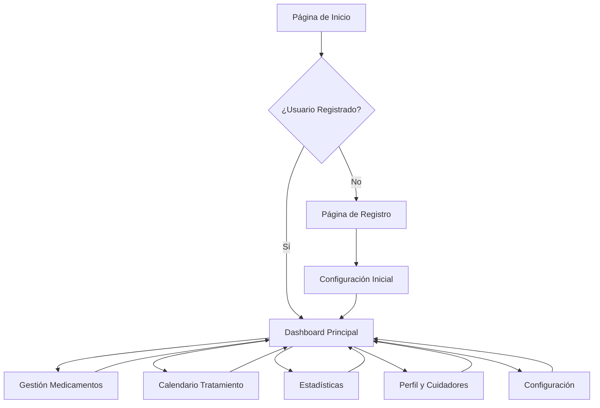

# MediTrack - Documento de Requisitos del Producto

## 1. Descripción General

### Visión del Producto
MediTrack es una aplicación móvil y web diseñada para mejorar la adherencia a medicamentos en personas mayores, facilitando el seguimiento de tratamientos médicos a través de recordatorios inteligentes, notificaciones multi-usuario y un sistema de gamificación que motiva el cumplimiento terapéutico.

### Usuarios Objetivo
- **Personas mayores (65+ años)**: Usuarios principales que necesitan gestionar múltiples medicaciones
- **Cuidadores familiares**: Hijos, nietos o familiares que supervisan el tratamiento
- **Cuidadores profesionales**: Personal de cuidados a domicilio o residencias

### Propuesta de Valor Principal
MediTrack convierte la gestión compleja de medicaciones en una experiencia simple y gratificante, reduciendo el estrés de olvidar medicamentos y mejorando la calidad de vida de pacientes y cuidadores mediante tecnología accesible y centrada en el usuario.

## 2. Funcionalidades Core

### 2.1 User Roles

| Rol | Método de Registro | Permisos Principales |
|------|---------------------|------------------|
| Paciente Principal | Email + verificación SMS | Gestión completa de medicaciones, visualización de estadísticas, configuración de recordatorios |
| Cuidador Familiar | Invitación por email del paciente | Recibir notificaciones, ver adherencia, añadir comentarios |
| Cuidador Profesional | Registro con licencia profesional | Gestión de múltiples pacientes, informes detallados, configuración avanzada |

### 2.2 Módulos de Funcionalidades

**Páginas principales de MediTrack:**
1. **Dashboard Principal**: Vista general del tratamiento diario, próximas tomas y estadísticas rápidas
2. **Gestión de Medicamentos**: Lista completa, añadir/editar medicaciones, configuración de horarios
3. **Calendario de Tratamiento**: Vista mensual/semanal de todas las tomas programadas
4. **Perfil y Cuidadores**: Gestión de información personal y red de cuidadores
5. **Estadísticas y Logros**: Visualización de adherencia, badges conseguidos y progreso
6. **Configuración**: Preferencias de notificaciones, accesibilidad y cuenta

### 2.3 Detalles de Páginas

| Nombre de Página | Módulo | Descripción de Funcionalidades |
|-----------|-------------|---------------------|
| Dashboard Principal | Resumen Diario | Mostrar medicaciones pendientes del día con botones grandes de confirmación, próximas tomas en las próximas 4 horas, indicador visual de progreso diario |
| Dashboard Principal | Alertas Activas | Mostrar recordatorios urgentes y mensajes de cuidadores con iconos y colores destacados |
| Dashboard Principal | Acceso Rápido | Botones de acceso directo a funciones más usadas con iconos grandes y texto descriptivo |
| Gestión Medicamentos | Lista de Medicamentos | Mostrar todos los medicamentos activos con foto, nombre, dosis y horarios en tarjetas grandes y claras |
| Gestión Medicamentos | Añadir Medicamento | Formulario guiado con campos: nombre, foto (opcional), dosis, frecuencia, horas específicas, duración del tratamiento, instrucciones especiales |
| Gestión Medicamentos | Detalle Medicamento | Vista completa con historial de tomas, opción de pausar/modificar/eliminar con confirmación |
| Calendario Tratamiento | Vista Calendario | Calendario mensual con colores por estado (tomado/pendiente/omitido), posibilidad de ver vista semanal |
| Calendario Tratamiento | Filtrado | Permitir filtrar por medicamento específico o ver todos |
| Perfil y Cuidadores | Información Personal | Datos del paciente, foto de perfil, información médica básica (alergias, condiciones) |
| Perfil y Cuidadores | Red de Cuidadores | Lista de cuidadores con foto, nombre, relación y nivel de permisos, botón para añadir nuevo cuidador |
| Estadísticas y Logros | Adherencia | Gráfico circular de adherencia mensual, tendencia de los últimos 3 meses, comparación con mes anterior |
| Estadísticas y Logros | Sistema Gamificación | Mostrar badges conseguidos (racha de 7 días, adherencia perfecta mensual, etc.), próximos badges disponibles |
| Configuración | Notificaciones | Activar/desactivar tipos de notificaciones, configurar horas de silencio, elegir tono de alarma |
| Configuración | Accesibilidad | Tamaño de fuente, contraste alto, modo de color, tiempo de confirmación de acciones |

## 3. Flujos de Usuario Principales

### Flujo del Paciente Principal
1. **Registro inicial**: El paciente se registra con email y número de teléfono
2. **Configuración básica**: Añade su primera medicación con ayuda del tutorial guiado
3. **Uso diario**: Recibe notificaciones y confirma tomas con botones grandes y simples
4. **Seguimiento**: Visualiza su progreso y consigue badges que refuerzan la adherencia

### Flujo del Cuidador
1. **Invitación**: Recibe email de invitación del paciente principal
2. **Registro**: Crea cuenta con permisos limitados según relación
3. **Supervisión**: Recibe notificaciones de adherencia y puede ver el calendario
4. **Apoyo**: Puede añadir notas y enviar mensajes de ánimo al paciente

## 4. Diseño de Interfaz de Usuario

### 4.1 Estilo de Diseño

**Colores Principales:**
- Primario: #2E8B57 (Verde mar, transmite salud y tranquilidad)
- Secundario: #FF6B35 (Naranja cálido, para acciones importantes)
- Fondo: #F8F9FA (Gris muy claro, reduce fatiga visual)
- Texto principal: #212529 (Gris oscuro, máxima legibilidad)
- Éxito/Confirmado: #28A745 (Verde brillante)
- Alerta: #FFC107 (Ámbar, visible pero no agresivo)

**Estilo de Botones:**
- Botones principales: Redondeados (border-radius: 12px), altura mínima 56px
- Botones secundarios: Bordes definidos, mismo tamaño mínimo
- Estados: Hover con cambio de color sutil, active con ligera sombra

**Tipografía:**
- Fuente principal: 'Inter' o 'Roboto', sans-serif
- Títulos: 24px mínimo (1.5rem)
- Texto normal: 18px mínimo (1.125rem)
- Botones: 20px mínimo (1.25rem)
- Espaciado entre líneas: 1.5x el tamaño de fuente

**Iconos y Animaciones:**
- Iconos: Estilo outline, grosor de 2px, mínimo 24x24px
- Animaciones: Transiciones suaves de 300ms, sin efectos parpadeantes
- Feedback visual: Checkmarks grandes y animaciones de confirmación

### 4.2 Diseño por Páginas

| Página | Módulo | Elementos de UI |
|-----------|-------------|-------------|
| Dashboard | Tarjetas Medicación | Tarjetas de 120px de altura mínimo, iconos de 32px, texto de 20px, botones de confirmación de 80x80px con iconos grandes |
| Dashboard | Barra de Progreso | Barra gruesa (16px), colores verde/naranja, porcentaje en texto grande debajo |
| Gestión Medicamentos | Lista | Tarjetas con sombra suave, foto del medicamento de 60x60px, información claramente jerarquizada |
| Gestión Medicamentos | Formulario | Campos con labels arriba, altura mínima 48px, validación en tiempo real con mensajes claros |
| Calendario | Vista Mensual | Celdas de mínimo 60px, colores diferenciados por estado, números grandes y claros |
| Estadísticas | Gráficos | Gráficos circulares grandes (mínimo 200px), leyendas con iconos, colores accesibles |

### 4.3 Responsividad y Accesibilidad

**Diseño Mobile-First:**
- Breakpoint principal: 768px para tablets
- Versión móvil: Una columna, botones de fácil acceso con el pulgar
- Versión desktop: Máximo 1200px de ancho, centrado, con espaciado generoso

**Optimización para Touch:**
- Áreas de click mínimo: 48x48px
- Espaciado entre elementos interactivos: mínimo 8px
- Gestos: Swipe para navegar entre días en el calendario

**Cumplimiento WCAG 2.1 AA:**
- Contraste mínimo 4.5:1 para texto normal
- Contraste 3:1 para texto grande (18px+)
- Navegación por teclado completa
- Screen reader friendly con ARIA labels
- No dependencia exclusiva de color para información

## 5. Modelo de Negocio

### Plan Gratuito
- Hasta 5 medicaciones activas
- 2 cuidadores en la red
- Recordatorios básicos
- Estadísticas semanales
- Publicidad no-intrusiva

### Plan Premium (5€/mes)
- Medicaciones ilimitadas
- Cuidadores ilimitados
- Recordatorios avanzados (múltiples horarios)
- Estadísticas completas y exportables
- Modo sin conexión
- Soporte prioritario
- Sin publicidad
- Copias de seguridad automáticas

## 6. Requisitos Técnicos

### Stack Tecnológico
- **Frontend**: React 18 + TypeScript + Vite
- **Estilos**: Tailwind CSS 3 + CSS Modules para componentes específicos
- **Backend**: Supabase (PostgreSQL, Auth, Storage)
- **Pagos**: Stripe para suscripciones premium
- **Notificaciones**: Web Push API + Firebase Cloud Messaging
- **PWA**: Service Workers para funcionamiento offline

### Requisitos de Rendimiento
- Tiempo de carga inicial: < 3 segundos en 3G
- Tiempo de interacción: < 100ms para acciones del usuario
- Tamaño del bundle: < 200KB para el JavaScript inicial
- Imágenes: Optimización automática con WebP, lazy loading

### Compatibilidad
- Navegadores: Chrome 90+, Firefox 88+, Safari 14+, Edge 90+
- Dispositivos: iOS 12+, Android 8+
- Resoluciones: Desde 320px de ancho

## 7. Casos de Uso Principales

### UC1: Paciente Registra Toma de Medicación
**Actor**: Paciente Principal
**Precondición**: Tiene medicaciones programadas para hoy
**Flujo**:
1. Recibe notificación en el móvil con sonido distintivo
2. Abre la app (se abre directamente en el dashboard)
3. Ve la medicación pendiente con botón grande "TOMAR"
4. Confirma la toma (puede añadir nota opcional)
5. Recibe feedback visual inmediato y badge si corresponde
6. La medicación se marca como completada

### UC2: Cuidador Recibe Notificación de Adherencia
**Actor**: Cuidador
**Precondición**: Está conectado al paciente con permisos de notificación
**Flujo**:
1. Recibe notificación de que el paciente no ha tomado medicación importante
2. Puede ver detalles de qué medicación y desde cuándo está pendiente
3. Tiene opciones: "Llamar", "Enviar mensaje", "Marcar como tomada"
4. Si el paciente confirma después, recibe actualización

### UC3: Administrar Nueva Medicación
**Actor**: Paciente o Cuidador con permisos
**Precondición**: Tienen información de la prescripción médica
**Flujo**:
1. Acceden a "Añadir Medicamento"
2. Pueden escanear código de barras o buscar en base de datos
3. Completan información: dosis, frecuencia, duración
4. El sistema sugiere horas basándose en el tipo de medicación
5. Configuran recordatorios y cuidadores que deben ser notificados
6. Guardan y el calendario se actualiza automáticamente

## 8. Criterios de Éxito

### Métricas de Adopción
- 1000 usuarios activos mensuales en los primeros 6 meses
- Tasa de retención a 30 días: > 40%
- Tasa de conversión free-to-premium: > 5%

### Métricas de Adherencia
- Mejora del 30% en la adherencia respecto al método tradicional
- Reducción de olvidos en medicaciones críticas: > 50%
- Satisfacción del usuario: NPS > 50

### Métricas de Usabilidad
- Tiempo promedio para confirmar toma: < 10 segundos
- Tasa de error en la interacción principal: < 1%
- Valoración de accesibilidad por usuarios mayores: > 4.5/5

### Métricas de Negocio
- CAC (Costo de Adquisición de Cliente): < 10€
- LTV (Lifetime Value): > 60€
- MRR (Monthly Recurring Revenue) a 12 meses: > 10,000€

## 9. Consideraciones de Seguridad y Privacidad

- Cumplimiento GDPR/LOPD
- Encriptación de datos sensibles
- Auditoría de acceso a información médica
- Control de consentimientos granular
- Derecho al olvido implementado
- Backup automático diario
- Autenticación de doble factor opcional

## 10. Cronograma de Desarrollo

**Fase 1 (Meses 1-2)**: MVP con funcionalidades básicas
- Dashboard, gestión de medicamentos, notificaciones básicas

**Fase 2 (Meses 3-4)**: Sistema de cuidadores y gamificación
- Red de cuidadores, badges, estadísticas básicas

**Fase 3 (Meses 5-6)**: Premium y optimización
- Sistema de pago, estadísticas avanzadas, modo offline

**Fase 4 (Meses 7-8)**: Escalabilidad y mejoras
- Optimización de rendimiento, soporte multi-idioma, integraciones médicas